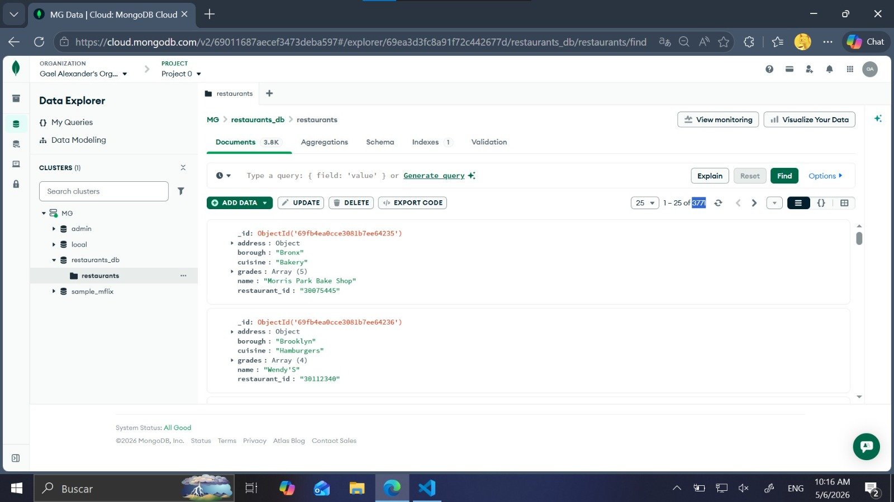
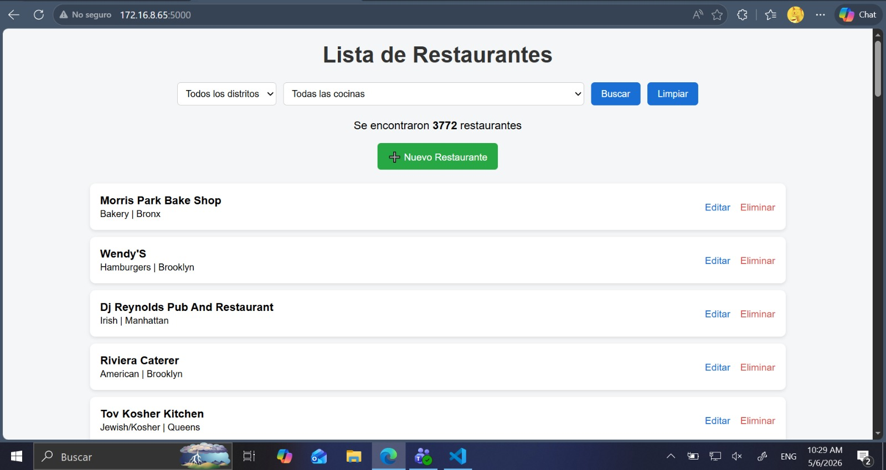
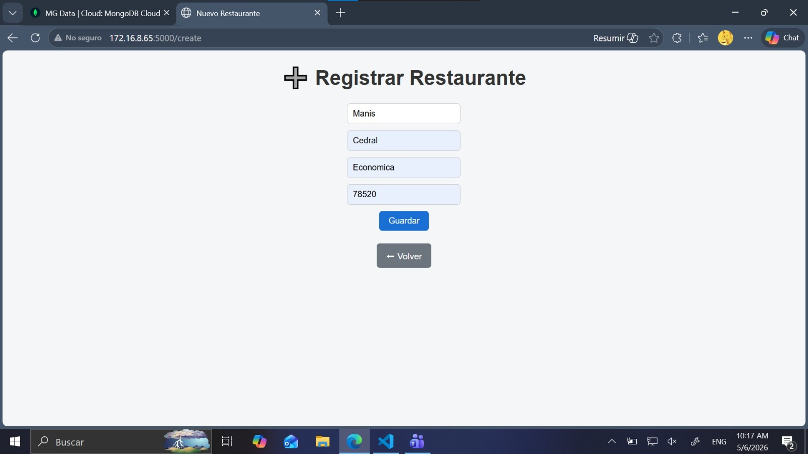
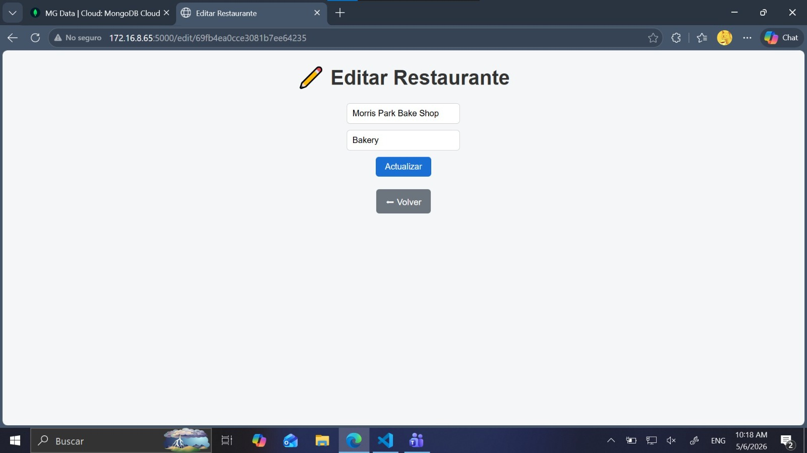
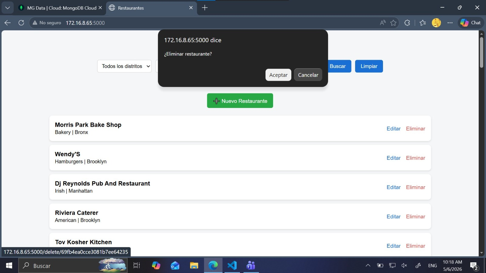

# 🍽️ Aplicación Web CRUD con Flask + MongoDB Atlas  
Gestión de Restaurantes

Este proyecto implementa una aplicación web funcional conectada a **MongoDB Atlas**, permitiendo realizar operaciones **CRUD** (Create, Read, Update, Delete) sobre un dataset real de restaurantes.  
La aplicación fue desarrollada con **Flask**, utilizando **PyMongo** para la conexión con la base de datos NoSQL.

---

## 📌 Funcionalidades

### 🔍 1. Visualización y Búsqueda (Read)
- Listado de restaurantes con nombre y tipo de cocina.  
- Filtro por **borough** (distrito) o **cuisine** (tipo de cocina).

### ➕ 2. Registro de Nuevo Restaurante (Create)
Formulario con los campos:
- Nombre  
- Distrito  
- Tipo de cocina  
- Código postal  

### ✏️ 3. Actualización (Update)
Edición del nombre y tipo de cocina mediante el **ID** del restaurante.

### 🗑️ 4. Eliminación (Delete)
Botón para borrar un restaurante con confirmación.

---

## 🗂️ Estructura del Proyecto

/static
styles.css
/templates
index.html
create.html
edit.html
app.py
load_data.py
restaurants.json
requirements.txt
README.md

---

## 🛠️ Tecnologías Utilizadas

- **Python 3.x**
- **Flask** (framework web)
- **MongoDB Atlas** (base de datos NoSQL)
- **PyMongo** (conexión a MongoDB)
- **HTML + CSS** (interfaz)

---

## 🌐 Conexión a MongoDB Atlas

La aplicación se conecta mediante PyMongo usando un URI como:

```python
client = MongoClient("mongodb+srv://<usuario>:<password>@<cluster>.mongodb.net/")
db = client["restaurants_db"]
collection = db["restaurants"]
```


## Carga del Dataset

El archivo restaurants.json se carga a la base de datos usando:
with open("restaurants.json", encoding="utf-8") as file:
    for line in file:
        data.append(json.loads(line))

collection.insert_many(data)

## Ejecucion de la App

1. instalar dependencias 
pip install -r requirements.txt

2. ejecutar flask 
python app.py

3. abrir el navegador
http://localhost:5000


## 📝 Reporte Breve

La aplicación fue desarrollada utilizando:

- **Flask** para manejar rutas, plantillas y formularios.
- **PyMongo** para la conexión con MongoDB Atlas.
- **MongoDB Atlas** como base de datos NoSQL en la nube.
- **HTML y CSS** para la interfaz de usuario.

La conexión a la base de datos se realiza mediante un URI de MongoDB Atlas, permitiendo ejecutar operaciones CRUD sobre la colección `restaurants`.

Las rutas implementadas son:

- `/` → Listado y filtros (Read)
- `/create` → Registro de nuevos restaurantes (Create)
- `/edit/<id>` → Edición de datos (Update)
- `/delete/<id>` → Eliminación de registros (Delete)

El dataset proporcionado se cargó mediante el script `load_data.py`, que inserta todos los documentos JSON en la colección.


## Ejemplo de corrida 
## 🖼️ Capturas de Pantalla

### 📌 Clúster en MongoDB Atlas


### 📌 Listado y búsqueda de restaurantes


### 📌 Registrar restaurante (Create)


### 📌 Editar restaurante (Update)


### 📌 Eliminar restaurante (Delete)



📚 Autor
Gael Alexander Basana Hernandez - Mariana Molina Villanueva
Gestión de Datos Masivos – Práctica CRUD con MongoDB Atlas